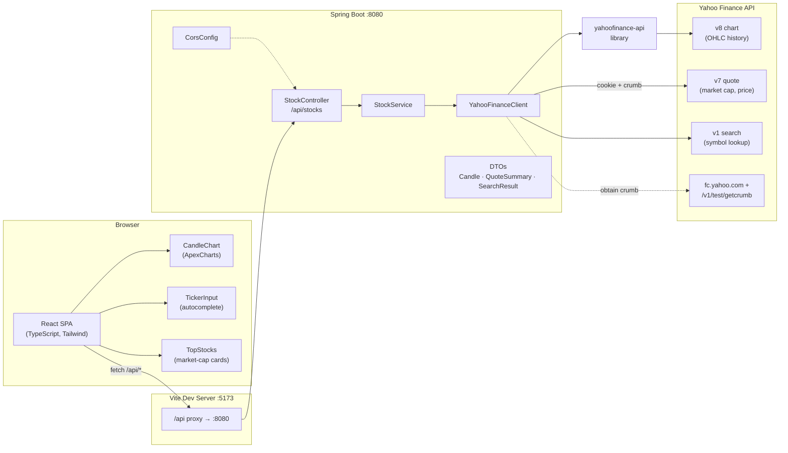
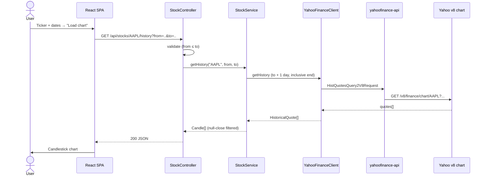
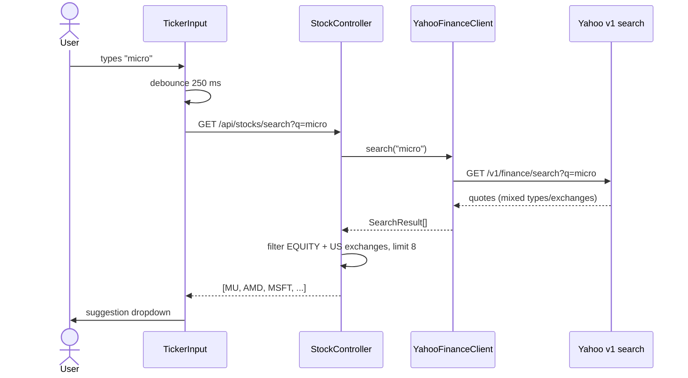
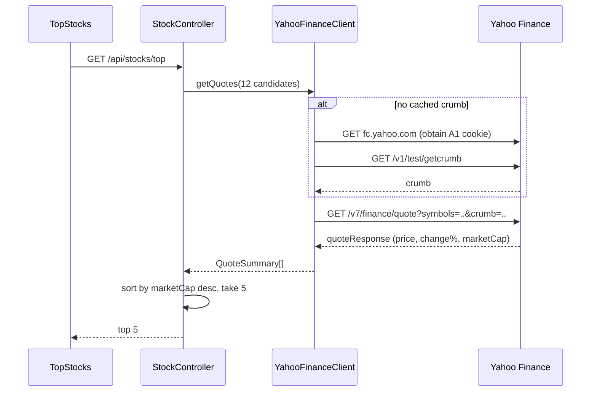

# Financial Dashboard — High-Level Design

## 1. System Overview

A single-page application that renders historical US stock prices as candlestick charts. The frontend talks to a Spring Boot REST API, which fetches market data from the Yahoo Finance API — historical candles through the `yahoofinance-api` Java library, and quotes/search through Yahoo's HTTP endpoints directly (cookie + crumb authentication).



## 2. Components

| Layer | Component | Responsibility |
|---|---|---|
| Frontend | `App` | Page state: ticker, date range, candles, loading/error |
| Frontend | `TickerInput` | Debounced (250 ms) autocomplete combobox; keyboard navigation (↑↓/Enter/Esc) |
| Frontend | `TopStocks` | Top-5-by-market-cap cards; click loads that ticker's chart |
| Frontend | `CandleChart` | ApexCharts candlestick rendering of OHLC data |
| Edge | Vite dev proxy | Forwards `/api/*` → `localhost:8080` (avoids CORS in dev) |
| Backend | `StockController` | REST endpoints, input validation, error mapping |
| Backend | `StockService` | Business logic: date-range handling, US-equity filtering, market-cap ranking |
| Backend | `YahooFinanceClient` | All Yahoo calls: history (library), quotes (crumb), search |
| Backend | `CorsConfig` | Allows `GET` from `http://localhost:5173` |

## 3. REST API

```
GET /api/stocks/{ticker}/history?from=YYYY-MM-DD&to=YYYY-MM-DD   → Candle[]
GET /api/stocks/top?limit=5                                      → QuoteSummary[]
GET /api/stocks/search?q=keyword                                 → SearchResult[]
```

## 4. Request Flows

### Load candlestick chart



### Ticker autocomplete



### Top-5 quotes (crumb-authenticated)



## 5. Key Design Decisions

- **`HistQuotesQuery2V8Request` over `YahooFinance.get()`** — the library's default path hits Yahoo's deprecated v7 endpoints (429/401). The v8 chart endpoint still works unauthenticated.
- **Manual crumb flow for quotes** — v7/quote requires Yahoo's A1 cookie + crumb. `YahooFinanceClient` fetches them lazily and retries once on 401/403.
- **Browser User-Agent required** — Yahoo returns 429 to the default Java UA. Set via `http.agent` at startup (covers the library) and per-request header on `HttpClient` calls.
- **Inclusive end date** — Yahoo's `period2` is exclusive; backend adds one day so the user's end date is included.
- **Server-side filtering for search** — Yahoo returns futures, foreign listings, funds; the backend narrows to US equities (NMS/NYQ/ASE/NGM/NCM/PCX/BTS) and caps at 8.
- **Generic 500 responses** — internal exception messages are logged, never echoed to clients.

## 6. Testing & Quality

| Suite | Scope |
|---|---|
| `StockServiceTest` | Unit: mapping, inclusive-end-date, top-N sorting, US-equity filtering |
| `StockControllerTest` | `@WebMvcTest`: endpoint contract, validation, error mapping |
| `ApiSecurityTest` | `@SpringBootTest`: CORS policy, HTTP methods, injection payloads, error leakage |
| `App.test.tsx` | Vitest + RTL: form, autocomplete flow, card-click loading, error states |
| JaCoCo | Coverage report → `backend/target/site/jacoco/` |
