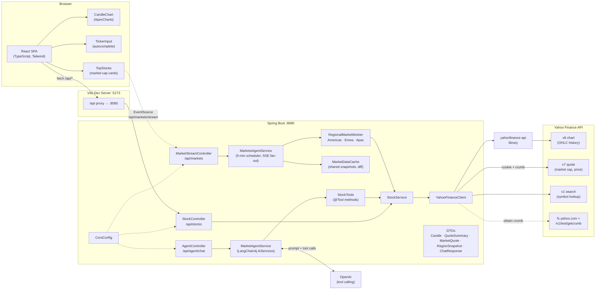
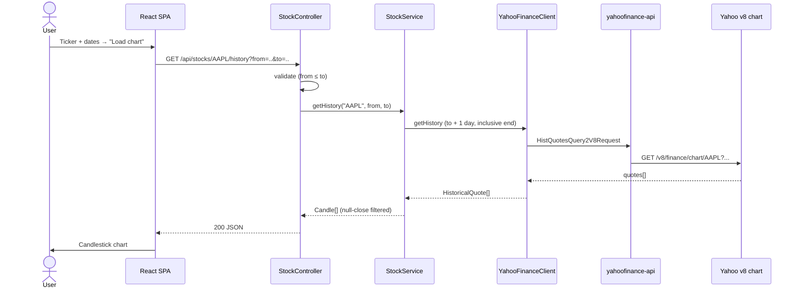
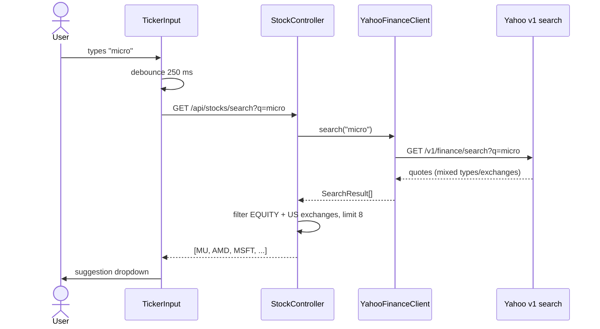
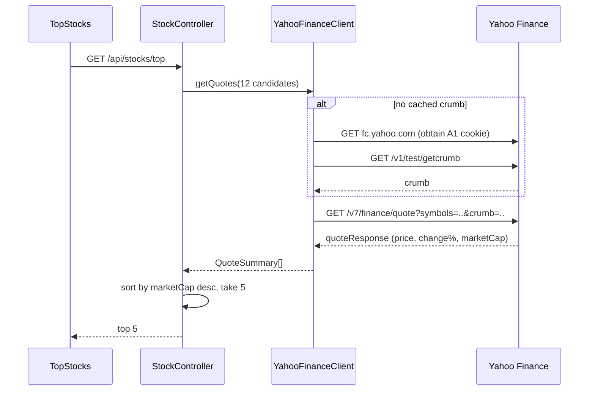

# Financial Dashboard — High-Level Design

## 1. System Overview

A single-page application ("Stocks Explorer") that shows live regional market watchlists and renders candlestick charts for any ticker. The frontend talks to a Spring Boot backend in two ways: plain REST for on-demand data (history, quote, search, agent chat) and **server-sent events** for live market data. A backend **Markets Agent** refreshes each region's top-20 on a shared market-hours-aware schedule (5 min open / 30 min closed), diffs each snapshot against a shared cache, and pushes only changed rows to connected dashboards. All market data ultimately comes from Yahoo Finance — historical candles through the `yahoofinance-api` Java library, and quotes/search through Yahoo's HTTP endpoints directly (cookie + crumb authentication).



## 2. Components

| Layer | Component | Responsibility |
|---|---|---|
| Frontend | `App` | Page state: ticker, date range, candles, quote, loading/error; scroll-to-details on tile select |
| Frontend | `TickerInput` | Debounced (250 ms) autocomplete combobox; searches only on real typing, never on programmatic value changes |
| Frontend | `TopStocks` | SSE-driven regional watchlists (memoized rows, STALE badge, freshness timestamp, per-region refresh button) |
| Frontend | `StockDetails` | Quote header (price, change, timestamp, market status), range chips, chart, stats grid |
| Frontend | `CandleChart` | ApexCharts candlestick rendering of OHLC data |
| Frontend | `AgentChat` | Floating Virtual Agent widget; per-tab `sessionId` |
| Edge | Vite dev proxy | Forwards `/api/*` → `localhost:8080` (avoids CORS in dev) |
| Backend | `StockController` | REST endpoints: history, quote, top, markets, search |
| Backend | `MarketStreamController` | SSE `GET /api/markets/stream`; `POST /api/markets/{region}/refresh` |
| Backend | `MarketsAgentService` | Shared scheduler (5-min, bounded backoff, no overlap), refresh → cache → publish, SSE emitter registry + heartbeat |
| Backend | `MarketDataCache` | Latest valid `RegionSnapshot` per region; returns changed-only diffs; retains+marks stale on failure |
| Backend | `RegionalMarketWorker` | Region coverage contract (`region()`, `candidates()`); impls: Americas, EMEA, APAC |
| Backend | `StockService` | Business logic: history, quotes, USD-normalized ranking, candidate pools |
| Backend | `YahooFinanceClient` | All Yahoo calls: history (library), quotes (crumb), search |
| Backend | `CorsConfig` | Env-driven allowed origins (`CORS_ALLOWED_ORIGINS`, localhost default) |

## 3. REST API

```
GET  /api/stocks/{ticker}/history?from=YYYY-MM-DD&to=YYYY-MM-DD   → Candle[]
GET  /api/stocks/{ticker}/quote                                   → QuoteSummary
GET  /api/stocks/top?limit=5                                      → QuoteSummary[]
GET  /api/stocks/markets?limit=20                                 → {REGION: QuoteSummary[]}
GET  /api/stocks/search?q=keyword                                 → SearchResult[]
GET  /api/markets/stream                                          → SSE (snapshot + market-update)
POST /api/markets/{region}/refresh                                → 202 / 404
GET  /api/health                                                  → {"status":"ok"}
POST /api/agent/chat  {message, sessionId}                        → {message, charts[]}
```

### Markets Agent

`MarketsAgentService` owns the live-data pipeline. A single-threaded `ScheduledExecutorService` runs an independent refresh loop per registered `RegionalMarketWorker`; each loop reschedules itself only after finishing, so refreshes can never overlap. On success it fetches the worker's **full candidate pool** (so a new company can displace the incumbent top 20), ranks by USD-normalized market cap, maps to `MarketQuote`s, and hands them to `MarketDataCache`, which diffs displayed fields (price, change%, market cap, status, source timestamp) against the previous snapshot. A `market-update` SSE event then carries only the changed quotes, the ranked `order`, and metadata (`lastSuccessAt`, `stale`, `consecutiveFailures`, `marketOpen`); freshness metadata advances either way. On failure the cache retains last-good quotes, marks the snapshot `stale`, and the service retries with bounded backoff (30s → 60s → … capped at 5 minutes). New SSE subscribers immediately receive a `snapshot` event with the whole cache, and a 25s heartbeat keeps proxies from idling the stream. `POST /api/markets/{region}/refresh` queues an out-of-band refresh on the same scheduler.

**Adaptive cadence.** Each worker declares `TradingWindow`s — local session times per covered exchange (AMERICAS: NYSE/Nasdaq/TSX 9:30–16:00 ET; APAC: Tokyo/HK/Seoul/Taipei/Sydney; EMEA: Continental Europe + Tadawul Sun–Thu). A region refreshes every **5 min while any window is open** and every **30 min when all are closed** (reduced rather than zero, so pre/post-market moves and new entrants are still tracked). `marketOpen` is stored on the snapshot, published in `market-update` events, and surfaced in the UI as a `closed` chip plus a disabled manual-refresh button. Exchange holidays aren't modeled — a holiday refresh at open cadence simply finds unchanged values.

### AI agent

`MarketAgentService` wraps a LangChain4j `AiServices` agent (OpenAI, tool calling) with per-`sessionId` `MessageWindowChatMemory` (20 messages). `StockTools` exposes four tools — `searchStocks`, `getTopStocks`, `getRegionalTopStocks`, `getStockHistory` — delegating to `StockService`. When `getStockHistory` runs, the full candle series is recorded in a per-request `ThreadLocal` collector while the LLM receives only a compact summary; chart payloads are attached to the response only when the user's message explicitly asks for one. The feature is disabled unless `OPENAI_API_KEY` is set (503 otherwise).

### Agent mesh (Stage 1)

A task-routed agent mesh backs the LLM agent: `GatewayAuthFilter` is the auth/policy boundary on `/api/agent/**` (Bearer/`X-API-Key` when `AGENT_API_KEY` is set); `AgentOrchestratorService` accepts tasks (`POST /api/agent/tasks`), routes each `AgentTask` by type to an `AgentWorker` (`DataAgentWorker` today: quote lookup, region snapshot, manual refresh), runs results through `ResultEvaluator` (`DeterministicResultEvaluator` — schema/sanity rules; evaluator rejection requeues once, worker exceptions become `ERROR`), and records every terminal outcome to `AuditStore` (in-memory ring buffer, or a durable Redis list when `AUDIT_STORE=redis`). Results are polled via `GET /api/agent/tasks/{id}`; the trail via `GET /api/agent/tasks/audit`. `TaskQueue` mirrors SQS semantics so Stage 2 replaces the in-memory queue without touching the orchestrator.

## 4. Request Flows

### Load candlestick chart



### Ticker autocomplete



### Live market updates (Markets Agent → SSE)

```mermaid
sequenceDiagram
    participant A as MarketsAgentService
    participant W as RegionalMarketWorker
    participant S as StockService
    participant C as MarketDataCache
    participant F as TopStocks (browser)

    Note over A: single-thread scheduler,<br/>next cycle queued after current ends

    loop every 5 min (bounded backoff on failure)
        A->>W: candidates()
        A->>S: rankCandidates(pool, 20)
        S-->>A: QuoteSummary[] (USD-normalized)
        alt success
            A->>C: applySuccess(region, quotes)
            C-->>A: changed[] (displayed-field diff)
            A->>F: event:market-update {changed, order, meta}
            F->>F: merge by symbol; unchanged rows<br/>not re-rendered (memo)
        else provider failure
            A->>C: applyFailure(region)
            C->>C: retain last-good quotes, stale=true
            A->>F: event:market-update {stale:true, changed:[]}
            F->>F: STALE badge; rows preserved
        end
    end

    Note over F,A: on (re)connect → event:snapshot {all cached regions}
```

### Top-5 quotes (crumb-authenticated)



## 5. Key Design Decisions

- **`HistQuotesQuery2V8Request` over `YahooFinance.get()`** — the library's default path hits Yahoo's deprecated v7 endpoints (429/401). The v8 chart endpoint still works unauthenticated.
- **Manual crumb flow for quotes** — v7/quote requires Yahoo's A1 cookie + crumb. `YahooFinanceClient` fetches them lazily and retries once on 401/403.
- **Browser User-Agent required** — Yahoo returns 429 to the default Java UA. Set via `http.agent` at startup (covers the library) and per-request header on `HttpClient` calls.
- **Inclusive end date** — Yahoo's `period2` is exclusive; backend adds one day so the user's end date is included.
- **Server-side filtering for search** — Yahoo returns futures, foreign listings, funds; the backend narrows to US equities (NMS/NYQ/ASE/NGM/NCM/PCX/BTS) and caps at 8.
- **Generic 500 responses** — internal exception messages are logged, never echoed to clients.
- **Single shared refresh loop** — one executor self-schedules each region's next cycle only after the current finishes: refreshes can't overlap, and all viewers consume the same cached snapshot instead of triggering their own Yahoo calls.
- **Adaptive cadence over fixed polling** — `TradingWindow`s let each region poll fast during trading hours and slow (not stop) when closed, cutting Yahoo calls ~80% while still catching pre/post-market moves. Declaring windows on the worker keeps coverage decisions with the region definition.
- **Full-pool refresh, not incumbent-only** — each cycle re-ranks the whole candidate pool, so a company can enter the top 20 without a code change; refreshing only the current top 20 couldn't detect that.
- **Publish diffs, not snapshots** — the cache compares displayed fields (price, change%, marketCap, status, source timestamp) and emits only changed rows + rank order; unchanged rows keep object identity and memoized React rows skip re-rendering. Freshness metadata still advances every successful refresh.
- **Failures never clear valid data** — a failed refresh marks the snapshot stale and bumps `consecutiveFailures`; recovery clears both. Bad/partial responses can never overwrite last-good values.
- **USD-normalized ranking** — Yahoo returns market caps in listing currency; FX pairs (`{CCY}USD=X`, inverted when only `USD{CCY}=X` exists) normalize before sorting. Display stays in local currency.
- **Regular-session prices only** — coverage decision: `regularMarketPrice` is used; extended-hours prices aren't blended. `marketState` drives UI status labels.
- **Typed-input guard on autocomplete** — `TickerInput` searches only when the value changed via real keystrokes, so programmatic sets (tile click, suggestion pick) never open the dropdown.

## 6. Testing & Quality

| Suite | Scope |
|---|---|
| `StockServiceTest` | Unit: mapping, inclusive-end-date, top-N sorting, US-equity filtering, FX ranking, dedupe |
| `StockControllerTest` | `@WebMvcTest`: endpoint contract (incl. `/quote`), validation, error mapping |
| `MarketStreamControllerTest` | `@WebMvcTest`: manual refresh → 202/404 |
| `MarketDataCacheTest` | Diff detection, freshness advance, stale retention, failure counts |
| `MarketsAgentServiceTest` | Bounded `nextDelayMs`, adaptive `delayAfterRefresh` (open/closed/failure), `marketOpen` via fixed clock, failure keeps last-good data |
| `MarketAgentServiceTest` | Chart-intent gating |
| `StockToolsTest` | Agent tool wiring incl. regional overview |
| `ApiSecurityTest` | `@SpringBootTest`: CORS policy, HTTP methods, injection payloads, error leakage |
| `AgentOrchestratorServiceTest` | Task routing, evaluator retry-then-fail, worker error mapping, audit recording |
| `DeterministicResultEvaluatorTest` | Per-type verdict rules (quote/snapshot/refresh) |
| `GatewayAuthFilterTest` | Bearer/X-API-Key auth on `/api/agent/**`, dev pass-through, non-agent paths unguarded |
| `AgentTaskControllerTest` | `@WebMvcTest`: submit → 202, status → 200/404, audit endpoint |
| `App.test.tsx` | Vitest + RTL: forms, autocomplete, SSE snapshot/update/stale flows, manual refresh, details panel, tile-click behavior |
| JaCoCo | Coverage report → `backend/target/site/jacoco/` |

## 7. Deployment (AWS)

Production topology is a single **CloudFront distribution** with two origins: the default behavior serves the built SPA from a private **S3** bucket (OAC), and `/api/*` proxies — uncached, uncompressed — to the Spring Boot container on **EC2** (image pulled from ECR; `OPENAI_API_KEY` injected from an SSM SecureString). Same-origin serving means CORS and `VITE_API_BASE` are non-issues. SSE survives the edge because `/api/*` disables compression and the app's 25s heartbeat sits under CloudFront's 60s origin read timeout. The EC2 security group only allows 8080 from CloudFront's origin-facing managed prefix list, so the backend is unreachable except through the distribution. Deploys run through GitHub Actions (OIDC → ECR push → SSM rolling restart; S3 sync → invalidation). Full runbook: `deploy/aws-setup.md`.
